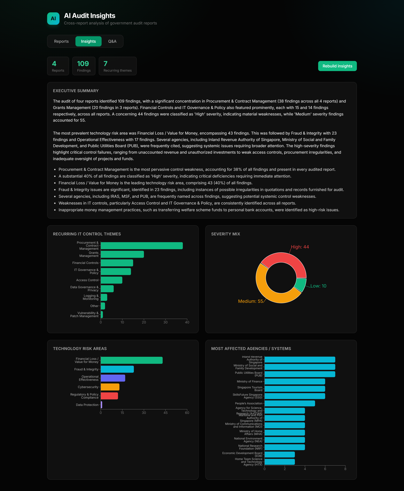
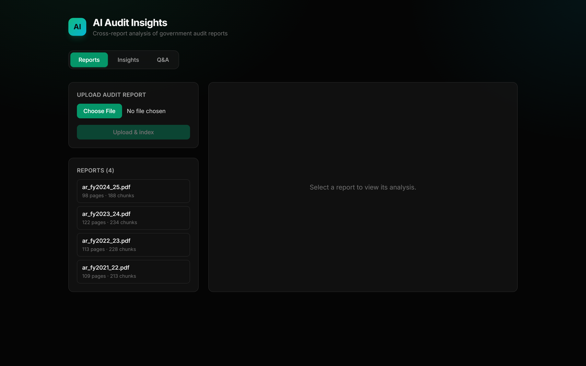
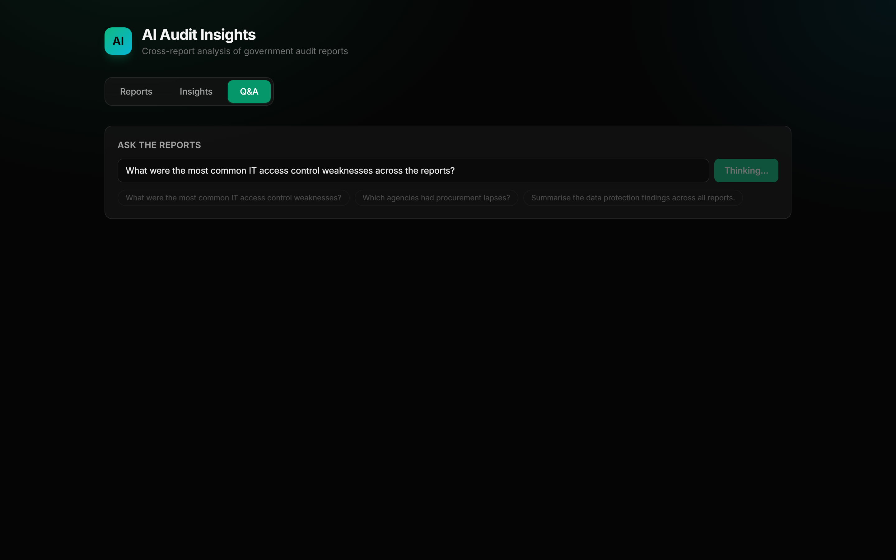

# AI Audit Insights

An AI application that analyses **multiple government audit reports together** and surfaces
cross-report insight: recurring IT control themes, common control weaknesses, technology risk
areas, most-affected agencies, an executive summary, and a cited Q&A chat.

> Verified end-to-end on 4 real Auditor-General's Office (AGO) annual reports → **109 structured
> findings**, with *Procurement & Contract Management* recurring across **all four** reports.



---

## The core idea

There are two different kinds of questions, and using one tool for both is the classic mistake:

| Question | Approach | Why |
|---|---|---|
| **"Which themes recur across all reports?"** (count / pattern) | **Structured extraction → aggregation in code** | Counting must see *every* finding, deterministically |
| **"What did they say about privileged accounts?"** (lookup) | **RAG** (vector retrieval → LLM) | Only a few relevant passages matter |

The LLM is used for what only it can do — **turning messy report prose into structured findings**
against a fixed taxonomy — and plain code does the **exact counting**. RAG is reserved for the
open-ended Q&A. A pure-RAG app cannot reliably answer "how often across all reports" questions,
because top-k retrieval only ever sees a handful of chunks.

---

## Features

- **Upload & index** audit PDFs → text extraction, chunking, local embeddings, vector store.
- **Cross-report insights** → recurring themes, technology risk areas, severity mix, most-affected
  agencies, and which themes recur across multiple reports.
- **Executive summary** → LLM narrative synthesised from the aggregated numbers.
- **Q&A chat (RAG)** → ask anything; answers are grounded in retrieved passages **with citations**.
- **Swappable LLM** → provider abstraction (Gemini today; another vendor is a one-file change).

| Reports | Q&A (RAG with citations) |
|---|---|
|  |  |

---

## Architecture

```
Browser (React + Tailwind + Recharts)
        │  /api  (Vite proxy)
        ▼
FastAPI
  Ingestion:  PDF → PyMuPDF → chunk → MiniLM embed → ChromaDB
  Extraction: full text → LLM (JSON mode) → Findings → SQLite
  Insights:   SQLite → aggregate (code) → counts → LLM exec summary
  Q&A:        question → embed → ChromaDB top-k → LLM answer + citations
  LLM behind a provider abstraction (Gemini, swappable)
        │                         │
        ▼                         ▼
   ChromaDB (vectors)      SQLite (reports + findings)
```

---

## Tech stack & why

| Concern | Choice | Why |
|---|---|---|
| Backend | **FastAPI** | async, Pydantic validation, auto OpenAPI docs |
| Frontend | **React + Tailwind + Recharts** | responsive UI + charts |
| PDF parsing | **PyMuPDF** | fast, robust text extraction |
| Embeddings | **sentence-transformers MiniLM (local)** | free, no quota, data stays local |
| Vector DB | **ChromaDB** | zero-infra persistent vector store |
| Structured store | **SQLite** | exact aggregation, zero setup |
| LLM | **Gemini 2.5 Flash** (swappable) | free tier, long context, native JSON mode |

---

## Getting started

**Prerequisites:** Python 3.13 (3.14 lacks ML wheels), Node 18+, a free Gemini API key
(https://aistudio.google.com/apikey).

### Backend
```bash
cd backend
python -m venv .venv
.venv/Scripts/activate            # Windows  (source .venv/bin/activate on macOS/Linux)
pip install -r requirements.txt   # heavy first install (torch); first run downloads MiniLM (~80 MB)
cp .env.example .env              # then set GEMINI_API_KEY
uvicorn app.main:app --reload     # http://localhost:8000  (interactive docs at /docs)
```

### Frontend
```bash
cd frontend
npm install
npm run dev                        # http://localhost:5173
```

Then: **Reports** → upload a PDF (samples in `materials/`) · **Insights** → *Generate insights* ·
**Q&A** → ask a question.

---

## API

| Method | Path | Purpose |
|---|---|---|
| GET  | `/health` | liveness + active model config |
| POST | `/upload` | PDF → extract → chunk → embed → store |
| GET  | `/reports` | list uploaded reports |
| POST | `/analyze/{id}` | basic per-report analysis |
| POST | `/extract/{id}` | extract structured findings for one report |
| POST | `/insights/build` | extract findings for all reports, then aggregate |
| GET  | `/insights` | cross-report aggregation |
| GET  | `/findings` | all structured findings |
| POST | `/insights/summary` | LLM executive summary |
| POST | `/qa` | RAG question answering with citations |

---

## Project structure

```
backend/app/
  api/routes.py       endpoints
  config.py           typed settings (fail-fast on missing key)
  llm/                provider abstraction (base, gemini, factory)
  ingestion/          pdf (PyMuPDF) + chunk
  extraction/         full text -> structured Findings (LLM JSON mode)
  models/             findings taxonomy + API schemas
  vectorstore/        embeddings (MiniLM) + ChromaDB
  insights/           aggregate (code) + executive summary (LLM)
  qa/                 RAG question answering
  storage/            SQLite (reports + findings)
frontend/src/         React app (Reports / Insights / Q&A)
materials/            sample audit reports
```

---

## Limitations & future work

- **Extraction quality is the ceiling** — a missed finding isn't counted; the aggregation itself
  is exact. Next step: an evaluation harness + human spot-checks.
- **No OCR** — scanned/image-only PDFs yield no text (detected, returns a clear error).
- **Insights build is sequential** — LLM extraction calls run one after another; would
  parallelise / move to a background job.
- **Single-node stores** — SQLite + Chroma suit this scope; production → Postgres + pgvector,
  plus authentication, rate limiting, and observability.
